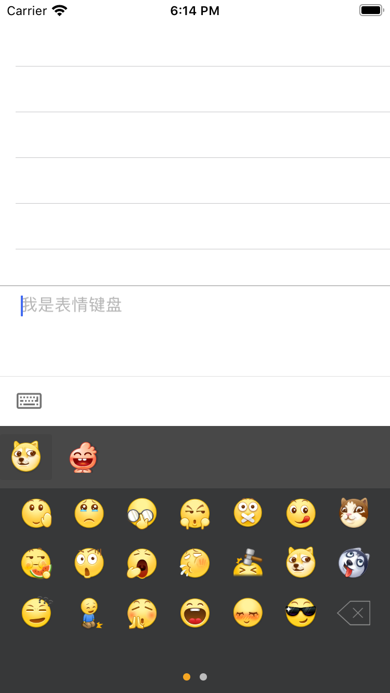

# BinartOCStickerKeyboard

[](https://travis-ci.org/fallending/BinartOCStickerKeyboard)
[](https://cocoapods.org/pods/BinartOCStickerKeyboard)
[](https://cocoapods.org/pods/BinartOCStickerKeyboard)
[](https://cocoapods.org/pods/BinartOCStickerKeyboard)

## Example

To run the example project, clone the repo, and run `pod install` from the Example directory first.



## Requirements

## Installation

BinartOCStickerKeyboard is available through [CocoaPods](https://cocoapods.org). To install
it, simply add the following line to your Podfile:

```ruby
pod 'BinartOCStickerKeyboard'
```

## Author

fallending, sevenli@lilithgames.com

## License

BinartOCStickerKeyboard is available under the MIT license. See the LICENSE file for more info.
